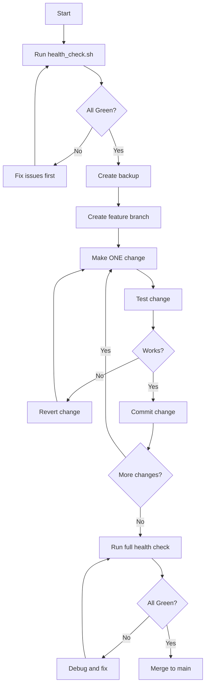

# PicoBrain Development Safeguards

## 🛡️ Preventing Breaking Changes

### 1. Pre-Change Checklist
Before making ANY changes to working code:

- [ ] Run `./health_check.sh` and save the output
- [ ] Create a backup: `./backup_project.sh`
- [ ] Document what's currently working
- [ ] Identify the specific problem to solve
- [ ] Check if the change affects other components

### 2. Change Management Rules

#### Rule 1: Never Touch Working Code Unless Necessary
- If login works → Don't modify auth code
- If employees display works → Don't modify that component
- Create NEW components/pages for testing, don't modify existing ones

#### Rule 2: Use Feature Branches
```bash
# Before making changes
git checkout -b feature/fix-employee-data

# Make changes and test
# If it works, merge
git checkout main
git merge feature/fix-employee-data

# If it breaks, abandon
git checkout main
git branch -D feature/fix-employee-data
```

#### Rule 3: Test Incrementally
```bash
# After EACH file change
./health_check.sh

# If something breaks, immediately revert
git checkout -- <file-that-broke-things>
```

### 3. Safe Development Workflow



### 4. Component Isolation Strategy

#### For Testing/Debugging
Create separate debug pages/components:
```
/app/(auth)/login/page.tsx         # DON'T TOUCH if working
/app/(auth)/login/debug/page.tsx   # CREATE for testing
```

#### For New Features
Create alongside existing:
```
/components/EmployeeTable.tsx      # Existing, working
/components/EmployeeTableV2.tsx    # New version for testing
```

### 5. Quick Recovery Commands

```bash
# View recent changes
git status
git diff

# Revert a specific file
git checkout -- path/to/file

# Revert last commit (keeping changes)
git reset --soft HEAD~1

# Hard reset to last known good commit
git reset --hard <commit-hash>

# Restore from backup
tar -xzf ../picobrain-backups/frontend_backup_TIMESTAMP.tar.gz
```

### 6. Testing Matrix

Before declaring "done", test ALL of these:

| Component | Test | Expected Result |
|-----------|------|-----------------|
| Backend Health | `curl http://localhost:8000/health` | 200 OK |
| Login | Use credentials admin@picobrain.com/admin123 | Get token |
| Employees API | GET /api/v1/employees with token | Returns data |
| Frontend Login | Navigate to /login | Shows form |
| Frontend Auth | Login and check localStorage | Token saved |
| Employee List | Navigate to /staff/employees | Shows data |

### 7. Communication Protocol

When working with Claude or any AI assistant:

1. **Be Specific About What Works**
   - "Login is working, don't change auth code"
   - "Employees page loads but data is empty"

2. **Request Isolated Changes**
   - "Create a debug component, don't modify the existing one"
   - "Add a test endpoint, don't change the working endpoint"

3. **Verify Before Applying**
   - "Show me the diff before applying"
   - "Let's test this in a separate file first"

### 8. Automated Safeguards

#### Pre-commit Hook
Create `.git/hooks/pre-commit`:
```bash
#!/bin/bash
echo "Running health check before commit..."
./health_check.sh
if [ $? -ne 0 ]; then
    echo "Health check failed! Fix issues before committing."
    exit 1
fi
```

#### Backup Script
Create `backup_project.sh`:
```bash
#!/bin/bash
timestamp=$(date +%Y%m%d_%H%M%S)
mkdir -p ../picobrain-backups

# Backup both frontend and backend
tar -czf ../picobrain-backups/full_backup_${timestamp}.tar.gz \
    --exclude='node_modules' \
    --exclude='venv' \
    --exclude='.next' \
    --exclude='__pycache__' \
    frontend/ backend/

echo "Backup created: ../picobrain-backups/full_backup_${timestamp}.tar.gz"
```

### 9. Documentation Requirements

For every change, document:
1. What was broken
2. What was changed
3. What was tested
4. What now works

Example:
```markdown
## Fix: Employee Data Empty
- **Problem**: API returns empty array despite data in DB
- **Change**: Added expire_on_commit=False to database.py
- **Tested**: Direct API call, frontend display
- **Result**: Employee data now displays correctly
```

### 10. Emergency Contacts

If something critical breaks:
1. Check `health_check.sh` output
2. Restore from latest backup
3. Check git log for recent changes
4. Revert problematic commits
5. Test incrementally

## Remember: If It Works, Don't Fix It!

The golden rule of development: Working code is precious. Protect it, back it up, and think twice before modifying it.